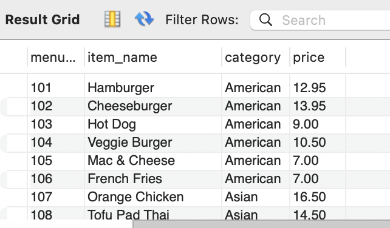

Restaurant Order Analysis
=========================
Kristen Healy  
2024-05-20

- [Executive Summary](#executive-summary)
- [Assignment](#assignment)
- [Data Analysis](#data-analysis)
  - [Menu Items](#duration)
  - [Orders](#ride-counts)
  - [Combined Data](#bike-types)
 
## Executive Summary


## Assignment
The fictional Taste of the World Café, a restaurant serving international cuisine, debuted a new menu at the beginning of the year. The business owner wants to get an understanding of how the new menu items are doing with customers: what's doing well and what's not, and what the top customers like best.

## Data Analysis
The data I've received is in a MySQL database, and consists of 2 tables:
- menu_items
- order_detail

The are 3 months of orders to analyze, covering January-March.

### Menu Items Table
```
/* set restaurant_db as the my default db */
USE restaurant_db;

/* preliminary view of the table */
SELECT *
FROM menu_items;
```


```
/* Summary menu item pricing info */
/* Price info: high, low, average & mode */
SELECT
	MAX(price) AS highest_price,
    MIN(price) AS lowest_price,
    ROUND(AVG(price),2) AS avg_price,
    (SELECT price
		FROM   menu_items
		GROUP  BY price
		ORDER  BY COUNT(*) DESC, price DESC
		LIMIT 1) AS most_frequent_price
FROM menu_items;
```

### Orders Table
### Combined Data
