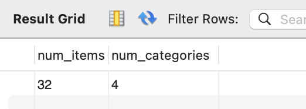
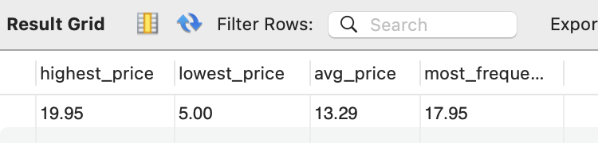
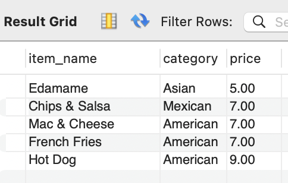
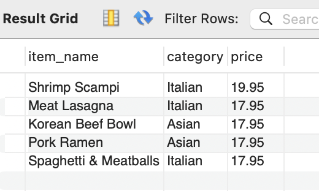
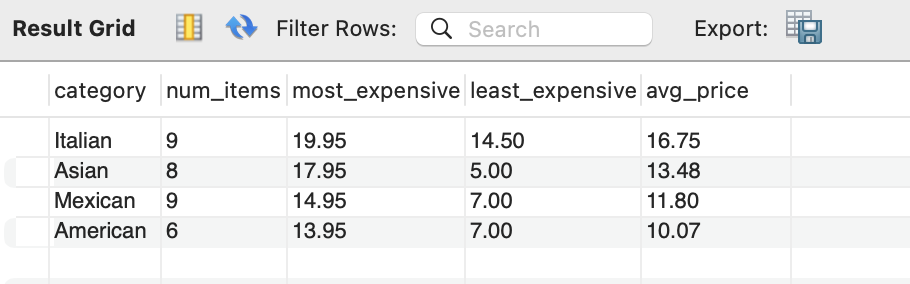

Restaurant Order Analysis
=========================
Kristen Healy  
2024-05-20


- [Assignment](#assignment)
- [Executive Summary](#executive-summary)
- [Detailed Analysis](#detailed-analysis)
  - [Menu Items](#menu-items-table)
  - [Orders](#orders-table)
  - [Combined Data](#combined-data)

## Assignment
The fictional Taste of the World Café, a restaurant serving international cuisine, debuted a new menu at the beginning of the year. The business owner wants to get an understanding of how the new menu items are doing with customers: what's doing well and what's not, and what the top customers like best.

Because the owner wants the information quickly and the data is in a MySQL database, all of the analysis will be done in SQL.

## Executive Summary
The menu has 32 items across 4 different international cuisines:
- Italian (9)
- Asian (8)
- Mexican (9)
- American (6)

Prices range from $5 (Edamame) to $19.95 (Shrimp Scampi), with an average menu item price of $13.29. Italian is the highest-priced category on average ($16.75), followed by Asian ($13.48). 

## Detailed Analysis
The restaurant consists of 2 tables:
- menu_items
- order_detail

The are 3 months of orders to analyze, covering January-March.

### Menu Items Table
```
/* set restaurant_db as the my default db */
USE restaurant_db;

/* preliminary view of the table */
SELECT *
FROM menu_items;
```


```
/* number of menu items and categories */
SELECT
    COUNT(menu_item_id) AS num_items,
    COUNT(DISTINCT category) AS num_categories
FROM menu_items;
```

```
/* Summary menu item pricing info */
SELECT
    MAX(price) AS highest_price,
    MIN(price) AS lowest_price,
    ROUND(AVG(price),2) AS avg_price,
    (SELECT price
		FROM   menu_items
		GROUP  BY price
		ORDER  BY COUNT(*) DESC, price DESC
		LIMIT 1) AS most_frequent_price
FROM menu_items;
```


```
/* What are the least expensive items on the menu?*/
SELECT
    item_name,
    category,
    price
FROM
	menu_items
ORDER BY
	price
LIMIT 5;
```

```
/* What are the most expensive items on the menu*/
SELECT
    item_name,
    category,
    price
FROM
	menu_items
ORDER BY
	price DESC
LIMIT 5;
```


```
/* summary pricing info by category */    
SELECT
	category,
    COUNT(menu_item_id) AS num_items,
    MAX(price) AS most_expensive,
    MIN(price) AS least_expensive,
    ROUND(AVG(price),2) AS avg_price
FROM menu_items
GROUP BY category
ORDER BY avg_price DESC, num_items DESC;
```


### Orders Table
### Combined Data
