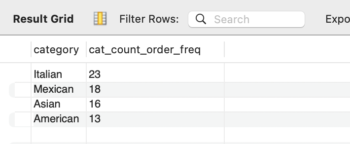

Restaurant Order Analysis
=========================
Kristen Healy  
2024-05-20


- [Assignment](#assignment)
- [Executive Summary](#executive-summary)
- [Detailed Analysis](#detailed-analysis)
  - [Menu Items](#menu-items-table)
  - [Orders](#orders-table)
  - [Combined Data](#combined-data)

## Assignment
The fictional Taste of the World Café, a restaurant serving international cuisine, debuted a new menu at the beginning of the year. The business owner wants to get an understanding of how the new menu items are doing with customers: which items are doing well and which are not, and what its top customers seem to like best.

Because the owner wants the information quickly and the data is in a MySQL database, all of the analysis will be done in SQL.

## Executive Summary
We have 3 months of order data--from January through March, with 5370 total orders and 12,234 items ordered. The 7 top orders by item count had 14 items on them, and 20 orders had more than 12 items. January and March had similar order numbers (1800+), while there was a dip in February (<1700).

The menu has 32 items across 4 different international cuisines:
- Italian (9)
- Asian (8)
- Mexican (9)
- American (6)

The Asian category had the most items ordered at 3470, followed by Italian (2948), Mexican (2945), and American (2734). Interestingly, although the American category trailed the rest, 3 of the most frequently ordered items were in that category:

- ** Hamburger, $12.95 **
- Edamame, $5
- Korean Beef Bowl, $17.95
- ** Cheeseburger, $13.95 **
- ** French Fries, $7 **

Prices range from $5 (Edamame) to $19.95 (Shrimp Scampi), with an average menu item price of $13.29. Italian is the highest-priced category on average ($16.75), followed by Asian ($13.48). 

And the least frequently ordered items were:
- Chicken Tacos, $11.95
- Postickers, $9
- Cheese Lasagna, $15.50
- Steak Tacos, $13.95
- Cheese Quasadillas, $10.50

The least freq

The top 5 orders by spend (>$185) ordered heavily from the Italian category,

**Note:** I used "top orders" as a proxy for "top customers" since we have order- and item-level data but not customer-level data.

## Detailed Analysis
The restaurant database consists of 2 tables:
- menu_items
- order_detail

### Menu Items Table
The menu_items table included the following columns:
- menu_item_id
- item_name
- category
- price

```
/* set restaurant_db as the my default db */
USE restaurant_db;

/* preliminary view of the table */
SELECT *
FROM menu_items;
```


```
/* number of menu items and categories */
SELECT
    COUNT(menu_item_id) AS num_items,
    COUNT(DISTINCT category) AS num_categories
FROM menu_items;
```

```
/* Summary menu item pricing info */
SELECT
    MAX(price) AS highest_price,
    MIN(price) AS lowest_price,
    ROUND(AVG(price),2) AS avg_price,
    (SELECT price
		FROM   menu_items
		GROUP  BY price
		ORDER  BY COUNT(*) DESC, price DESC
		LIMIT 1) AS most_frequent_price
FROM menu_items;
```


```
/* What are the least expensive items on the menu?*/
SELECT
    item_name,
    category,
    price
FROM
	menu_items
ORDER BY
	price
LIMIT 5;
```

```
/* What are the most expensive items on the menu*/
SELECT
    item_name,
    category,
    price
FROM
	menu_items
ORDER BY
	price DESC
LIMIT 5;
```


```
/* summary pricing info by category */    
SELECT
	category,
    COUNT(menu_item_id) AS num_items,
    MAX(price) AS most_expensive,
    MIN(price) AS least_expensive,
    ROUND(AVG(price),2) AS avg_price
FROM menu_items
GROUP BY category
ORDER BY avg_price DESC, num_items DESC;
```


### Orders Table
The table contains rows for each order_details_id. The order_details table included the following columns:
- order_details_id
- order_id
- order_date
- order_time
- item_id

```
/* view order details table */
SELECT *
FROM
	order_details;
```

```
/* What order dates are included in the table? */
SELECT 
	MIN(order_date) AS first_date,
    MAX(order_date) AS last_date
FROM
	order_details;
 ```

```
/* 	How many orders?
	How many items were ordered?
*/

SELECT 
	COUNT(DISTINCT order_id) AS num_orders,
    COUNT(order_details_id) num_order_items
FROM order_details;
```

```
/*	Which orders had the most items? */
SELECT 
	order_id,
	COUNT(item_id) AS num_items
FROM
	order_details
GROUP BY
	order_id
ORDER BY
	num_items DESC;
```

```
/*	How many orders had more than 12 items: */

SELECT COUNT(*) FROM
(SELECT
	order_id,
	COUNT(item_id) AS num_items
FROM
	order_details
GROUP BY
	order_id
HAVING
	num_items > 12) AS num_orders;
```


```
/* Are there any differences in order/item counts by month? */
SELECT 
    MONTH(order_date) AS order_month,
	COUNT(DISTINCT order_id) AS num_orders,
    COUNT(item_id) AS num_items
FROM order_details 
GROUP BY order_month;
```


### Combined Data

After becoming familiar with the two tables, I joined them for further analysis.
```
/* 	Create view combining the menu_items table and the order_details table.
	We'll use this in other queries.
*/
CREATE VIEW full_order_details AS
SELECT *
FROM
	order_details
LEFT JOIN menu_items
	ON order_details.item_id = menu_items.menu_item_id;

SELECT *
FROM
	full_order_details;
```


```
/* most often ordered (items)*/
SELECT
	item_name,
    category,
    price,
    COUNT(item_id) AS item_count
FROM
	full_order_details
GROUP BY
	item_name,category,price
ORDER BY
	item_count DESC;
```


```
/* most often ordered (categories)*/
SELECT
	category,
    ROUND(AVG(price),2) AS avg_price,
    COUNT(category) AS cat_count
FROM
	full_order_details
GROUP BY
	category
ORDER BY
	cat_count DESC;
```


```
/* rank orders by highest spend */
SELECT 
	order_id,
	SUM(price) AS total_price
FROM
	full_order_details
GROUP BY order_id
ORDER BY total_price DESC;
```

```
/* rank orders by highest number of items with order total as tiebreaker */
SELECT 
	order_id,
    COUNT(item_id) AS item_count
FROM
	full_order_details
GROUP BY order_id
ORDER BY item_count DESC, SUM(price) DESC;
```


```
/* order 2075 was in the top 5 by spend but not by total items...
	order 3473 was in the top 5 by total items but not by spend...
    what was on these 2 orders?
*/
SELECT 
	order_id,
    item_name,
    category,
    COUNT(item_id),
    price
FROM 
	full_order_details
WHERE 
	order_id 
		IN (2075,3473)
GROUP BY 1,2,3,5
ORDER BY order_id, price DESC;
```


```
/* order details of highest spend order */
SELECT
	order_id,
	category,
    item_name,
    price,
    COUNT(item_name) num_items
FROM 
	full_order_details
WHERE 
	order_id = 
    (SELECT order_id
    FROM
		full_order_details
		GROUP BY order_id
		ORDER BY SUM(price) DESC
		LIMIT 1) -- returns order id of the order with the highest order total
GROUP BY order_id,category,item_name, price
ORDER BY num_items DESC;
```

```
/* category count for top order by spend */
SELECT
	order_id,
	category,
    COUNT(category) AS items_in_cat
FROM 
	full_order_details
WHERE 
	order_id = 
    (SELECT order_id
    FROM
		full_order_details
		GROUP BY order_id
		ORDER BY SUM(price) DESC
		LIMIT 1)
GROUP BY order_id, category
ORDER BY items_in_cat DESC;
```

```
/* items from top 5 orders by spend*/
WITH top_five AS
	(SELECT 
		order_id
	FROM
		full_order_details
	GROUP BY order_id
	ORDER BY SUM(price) DESC
	LIMIT 5)
SELECT
	category,
    item_name,
    price,
    COUNT(item_name) num_items
FROM 
	full_order_details
WHERE 
	order_id IN
		(SELECT order_id
		FROM
			top_five)
GROUP BY category,item_name, price
ORDER BY num_items DESC;
```

```
/* items from 5 top orders by item count*/
WITH top_five AS
	(SELECT 
		order_id
	FROM
		full_order_details
	GROUP BY order_id
	ORDER BY COUNT(item_id) DESC, SUM(price) DESC
	LIMIT 5)
SELECT
	category,
    item_name,
    price,
    COUNT(item_id) num_items
FROM 
	full_order_details
WHERE 
	order_id IN
		(SELECT order_id
		FROM
			top_five)
GROUP BY category,item_name, price
ORDER BY num_items DESC;
```


```
/* category count for top 5 orders by spend*/
WITH top_five AS
	(SELECT 
		order_id
	FROM
		full_order_details
	GROUP BY order_id
	ORDER BY SUM(price) DESC
	LIMIT 5)
SELECT
	category,
    COUNT(category) cat_count_order_freq
FROM 
	full_order_details
WHERE 
	order_id IN
		(SELECT order_id
		FROM
			top_five)
GROUP BY category
ORDER BY cat_count_order_freq DESC;
```

```
/* category count for top 5 orders by item count*/
WITH top_five AS
	(SELECT 
		order_id
	FROM
		full_order_details
	GROUP BY order_id
	ORDER BY COUNT(item_id) DESC, SUM(price) DESC
	LIMIT 5)
SELECT
	category,
    COUNT(category) cat_count_order_freq
FROM 
	full_order_details
WHERE 
	order_id IN
		(SELECT order_id
		FROM
			top_five)
GROUP BY category
ORDER BY cat_count_order_freq DESC;
```

